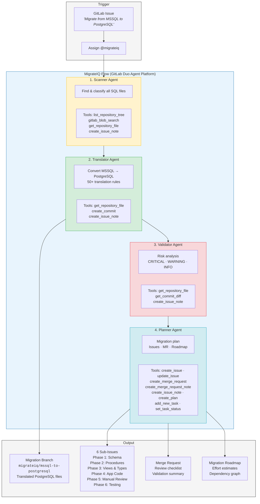
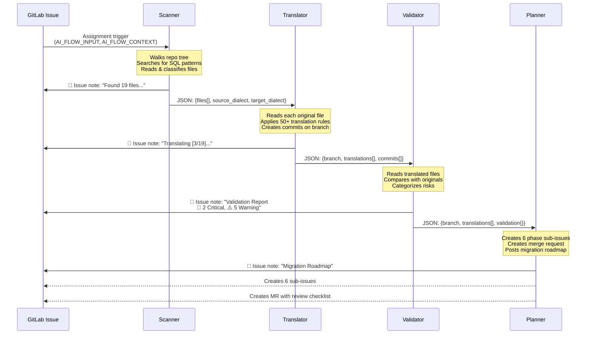
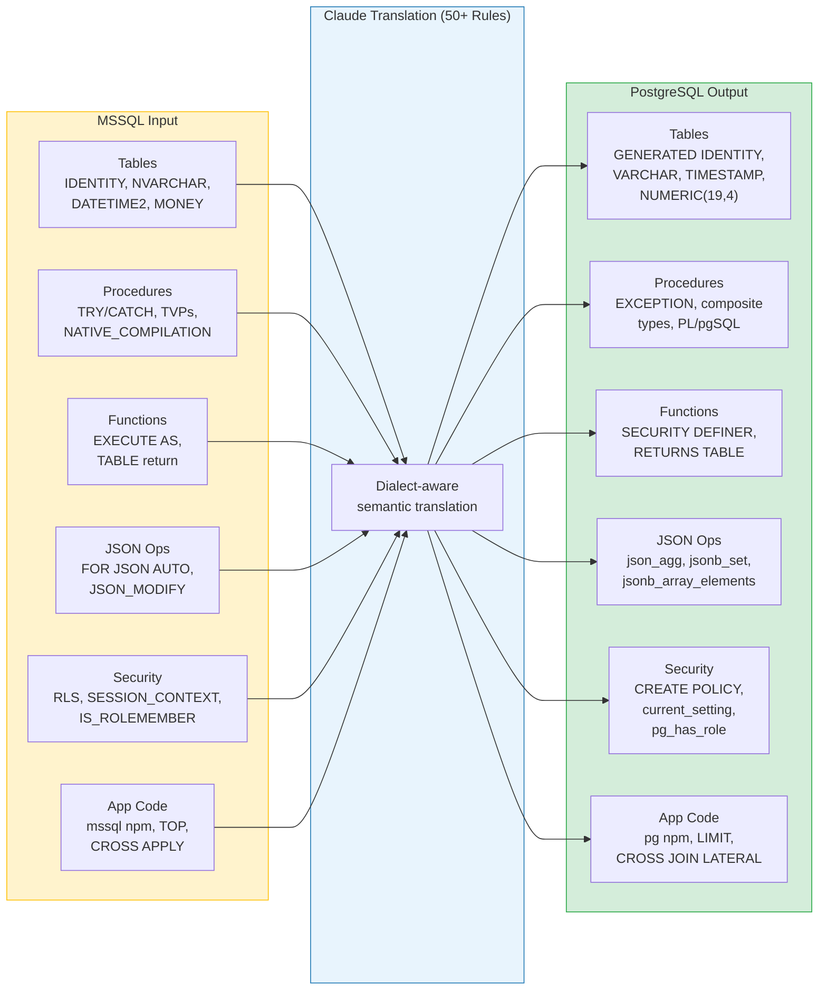

# MigrateIQ Architecture

## System Overview

## Data Flow Between Agents

## Translation Pipeline Detail

## Tool Usage Map

| Agent | Tool | Purpose |
|-------|------|---------|
| Scanner | `list_repository_tree` | Walk directory structure |
| Scanner | `gitlab_blob_search` | Find SQL patterns in files |
| Scanner | `get_repository_file` | Read file contents for classification |
| Scanner | `create_issue_note` | Post scan results |
| Translator | `get_repository_file` | Read original files |
| Translator | `create_commit` | Commit translated files to migration branch |
| Translator | `create_issue_note` | Post translation progress |
| Validator | `get_repository_file` | Read translated files |
| Validator | `get_commit_diff` | Compare original vs translated |
| Validator | `create_issue_note` | Post risk report |
| Planner | `create_issue` | Create phase sub-issues |
| Planner | `update_issue` | Add labels and metadata |
| Planner | `create_merge_request` | Create MR from migration branch |
| Planner | `create_merge_request_note` | Add review checklist to MR |
| Planner | `create_issue_note` | Post migration roadmap |
| Planner | `create_plan` | Create structured task plan |
| Planner | `add_new_task` | Add tasks to the plan |
| Planner | `set_task_status` | Update task completion |

**13 unique tools** across 4 agents.
